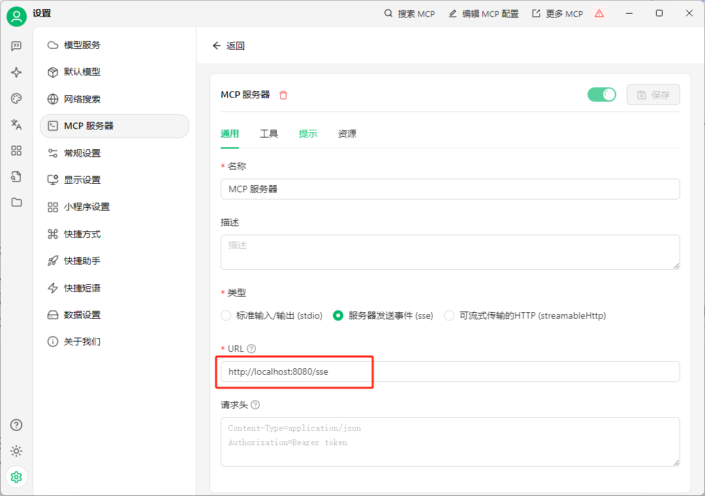
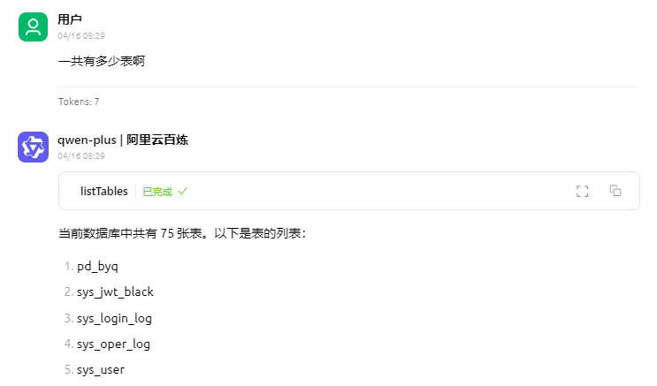
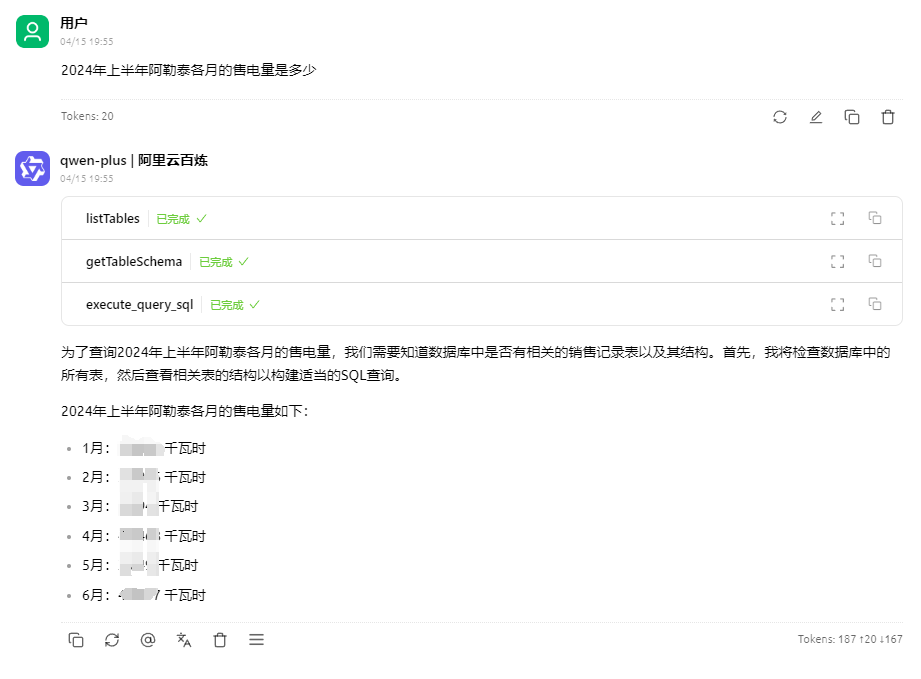

## 基于Java开发的智能数据分析大模型MCP服务器

下面是使用Java语言开发的一个简单的数据库查询MCP服务器（适配MySQL、Oracle、PG数据库），并通过Cherry Studio进行测试。

## 安装依赖

将以下 Maven 依赖添加到你的项目中：

使用MCP官方的Java SDK：

```xml
<dependency>
    <groupId>io.modelcontextprotocol.sdk</groupId>
    <artifactId>mcp</artifactId>
    <version>0.8.1</version>
</dependency>
```

对于 HTTP SSE 传输实现，添加以下依赖之一：

```xml
<!-- 基于 Spring WebFlux 的 SSE 客户端和服务器传输 -->
<dependency>
    <groupId>io.modelcontextprotocol.sdk</groupId>
    <artifactId>mcp-spring-webflux</artifactId>
</dependency>

<!-- 基于 Spring WebMVC 的 SSE 服务器传输 -->
<dependency>
    <groupId>io.modelcontextprotocol.sdk</groupId>
    <artifactId>mcp-spring-webmvc</artifactId>
</dependency>
```

添加数据库适配器，参考我的另外一个项目：https://github.com/daydayup-zyn/db-connector
```xml
<dependency>
    <groupId>cn.daydayup.dev</groupId>
    <artifactId>connector-core</artifactId>
    <version>1.0-SNAPSHOT</version>
</dependency>
```

## 服务端对象

服务器同时支持同步和异步API，这里我们选择创建同步服务器。

```java
// 创建并配置MCP同步服务器
McpSyncServer syncServer = McpServer.sync(transportProvider)
        .serverInfo("wenshu-server", "1.0.0")
        .capabilities(McpSchema.ServerCapabilities.builder()
                .tools(true)
                //.resources(true,true)
                //.prompts(true)
                .logging()
                .build())
        .build();

try {
    // 添加工具、资源和提示
    syncServer.addTool(listTables());
    syncServer.addTool(getTableSchema());
    syncServer.addTool(executeMysqlQuery());
    syncServer.addPrompt(selectTablePrompt());
    syncServer.addPrompt(text2sqlPrompt());

    // 发送日志通知
    syncServer.loggingNotification(McpSchema.LoggingMessageNotification.builder()
            .level(McpSchema.LoggingLevel.INFO)
            .logger("custom-logger")
            .data("Server initialized")
            .build());
}catch (Exception e){
    // 处理异常，例如打印错误信息
    log.error("MCP服务器创建时发生错误: {}" , e.getMessage());
    e.printStackTrace();
}
```

## 服务器传输

创建基于WebMvc的SSE服务器传输，需要 mcp-spring-webmvc 依赖。

```java
@Configuration
public class McpConfig{

    @Bean
    WebMvcSseServerTransportProvider webMvcSseServerTransportProvider(ObjectMapper mapper) {
        return new WebMvcSseServerTransportProvider(mapper, "/messages");
    }

    @Bean
    RouterFunction<ServerResponse> mcpRouterFunction(WebMvcSseServerTransportProvider transportProvider) {
        return transportProvider.getRouterFunction();
    }
}
```

如使用基于WebFlux的SSE服务器传输，则需要 mcp-spring-webflux 依赖。

```java
@Configuration
class McpConfig {
    @Bean
    WebFluxSseServerTransport webFluxSseServerTransport(ObjectMapper mapper) {
        return new WebFluxSseServerTransport(mapper, "/messages");
    }

    @Bean
    RouterFunction<?> mcpRouterFunction(WebFluxSseServerTransport transport) {
        return transport.getRouterFunction();
    }
}
```

以上WebMvcSseServerTransportProvider或者WebFluxSseServerTransport中的`/messages`​可以任意写，只要和项目中已有的URI不冲突就行。

## 服务器功能

### 工具
要构建一个MySQL数据查询MCP服务器，需要我们在MCP服务器中为大模型提供三个工具，分别为：

* listTables：获取当前数据库中所有表的列表；
* getTableSchema：获取指定数据表的结构（列信息）；
* executeMysqlQuery：执行给定的 SQL 查询语句并返回结果或错误信息。

```java
/**
 * 获取当前数据库中所有表的列表。
 * @return McpServerFeatures.SyncToolSpecification
 */
private McpServerFeatures.SyncToolSpecification listTables(){
    String desc = """
            获取当前数据库中所有表的列表。
            内部调用 execute_mysql_query 执行 'SHOW TABLES;'。
            """;
    String schema = """
            {
              "type" : "object",
              "id" : "urn:jsonschema:Operation",
              "properties" : {
              }
            }
            """;
    return new McpServerFeatures.SyncToolSpecification(
            new McpSchema.Tool("listTables", desc, schema),
            (exchange, arguments) -> {
                List<McpSchema.Content> result = new ArrayList<>();

                String sql = "SHOW TABLES;";
                try {
                    String tableList = execute_mysql_query(sql);
                    result.add(new McpSchema.TextContent("所有的表: " + tableList));
                }catch (Exception e){
                    // 处理计算过程中的异常
                    result.add(new McpSchema.TextContent("所有的表: " + e.getMessage()));
                }
                return new McpSchema.CallToolResult(result, false);
            }
    );
}

/**
 * 获取指定数据表的结构（列信息）。
 * @return McpServerFeatures.SyncToolSpecification
 */
private McpServerFeatures.SyncToolSpecification getTableSchema(){
    String desc = """
            获取指定数据表的结构（列信息）。
                内部调用 execute_mysql_query 执行 'DESCRIBE table_name;'。
                Args:
                    tableName (str): 需要查询结构的数据表名称。
                Returns:
                    str: 表结构的格式化字符串或错误信息。
            """;
    String schema = """
            {
              "type" : "object",
              "id" : "urn:jsonschema:Operation",
              "properties" : {
                "tableName" : {
                  "type" : "string"
                }
              }
            }
            """;

    return new McpServerFeatures.SyncToolSpecification(
            new McpSchema.Tool("getTableSchema", desc, schema),
            (exchange, arguments) -> {
                List<McpSchema.Content> result = new ArrayList<>();
                String tableName = (String)arguments.get("tableName");
                String sql = "DESCRIBE "+tableName+";";
                try {
                    String tableList = execute_mysql_query(sql);
                    result.add(new McpSchema.TextContent("表结构: " + tableList));
                }catch (Exception e){
                    // 处理计算过程中的异常
                    result.add(new McpSchema.TextContent("表结构: " + e.getMessage()));
                }
                return new McpSchema.CallToolResult(result, false);
            }
    );
}

/**
 * 执行给定的 SQL 查询语句并返回结果或错误信息。
 * @return McpServerFeatures.SyncToolSpecification
 */
private McpServerFeatures.SyncToolSpecification executeMysqlQuery(){
    String desc = """
            执行给定的 SQL 查询语句并返回结果或错误信息。
                Args:
                    sqlQuery (str): 由 LLM 生成的 SQL 查询语句。
                Returns:
                    str: 格式化后的查询结果字符串或错误信息字符串。
                         对于 SELECT，返回表头和数据行。
                         对于 INSERT/UPDATE/DELETE，返回影响的行数。
                         对于错误，返回具体的错误信息。
            """;
    String schema = """
            {
              "type" : "object",
              "id" : "urn:jsonschema:Operation",
              "properties" : {
                "sqlQuery" : {
                  "type" : "string"
                }
              }
            }
            """;
    return new McpServerFeatures.SyncToolSpecification(
            new McpSchema.Tool("execute_query_sql", desc, schema),
            (exchange, arguments) -> {
                List<McpSchema.Content> result = new ArrayList<>();
                String sqlQuery = (String)arguments.get("sqlQuery");
                try {
                    String tableList = execute_mysql_query(sqlQuery);
                    result.add(new McpSchema.TextContent("查询结果: " + tableList));
                }catch (Exception e){
                    // 处理计算过程中的异常
                    result.add(new McpSchema.TextContent("查询结果: " + e.getMessage()));
                }
                return new McpSchema.CallToolResult(result, false);
            }
    );
}
```

### Prompt提示词

构建数据查询MCP服务器，需要我们为MCP服务器添加以下提示词：
* selectTablePrompt：目标表选择提示词模板；
* text2sqlPrompt：Text2SQL提示词模板。

```java
/**
 * 添加目标表选择提示到服务器
 */
private McpServerFeatures.SyncPromptSpecification selectTablePrompt() {
    String selectTablePrompt = """
            ### 指令: 基于表描述信息理解用户的查询内容并推断哪些表与用户的查询属性最相关。
            ### 表信息: {tableInfo}
            ### 输入: {userInput}
            ### 输出: 返回相关度最高的表名，不要返回任何不必要的解释，多个表用逗号分隔开。
            """;
    // 创建提示规范，包含提示定义和处理逻辑
    return new McpServerFeatures.SyncPromptSpecification(
            // 定义提示的基本信息和参数
            new McpSchema.Prompt("selectTablePrompt", "目标表选择提示词模板",
                    new ArrayList<>(
                            List.of(
                                new McpSchema.PromptArgument("tableInfo", "数据库所有的表名和表描述", true),
                                new McpSchema.PromptArgument("userInput", "用户输入的问题", true)
                    ))),
            (exchange, request) -> {
                // 处理提示请求
                List<McpSchema.PromptMessage> messages = new ArrayList<>();
                String tableInfo = (String) request.arguments().get("tableInfo");
                String userInput = (String) request.arguments().get("userInput");

                String finalPrompt = selectTablePrompt.replace("{tableInfo}", tableInfo).replace("{userInput}", userInput);

                // 创建对话消息序列
                McpSchema.PromptMessage userMessage = new McpSchema.PromptMessage(
                        McpSchema.Role.USER,
                        new McpSchema.TextContent(finalPrompt));

                messages.add(userMessage);
                return new McpSchema.GetPromptResult("目标表选择提示词模板", messages);
            });
}

/**
 * 添加Text2SQL提示到服务器
 */
private McpServerFeatures.SyncPromptSpecification text2sqlPrompt() {
    String selectTablePrompt = """
            ### 指令: 熟悉MySQL数据库相关的SQL功能，你的任务是根据用户输入和表结构信息，生成符合要求且可实际执行的SQL语句。
            ### 表结构：{tableSchema}
            ### 用户输入: {userInput}
            ### 输出要求: 输出分析思路和SQL语句，输出字段必须为中文描述。
            """;
    // 创建提示规范，包含提示定义和处理逻辑
    return new McpServerFeatures.SyncPromptSpecification(
            // 定义提示的基本信息和参数
            new McpSchema.Prompt("text2sqlPrompt", "Text2SQL提示词模板",
                    new ArrayList<>(
                            List.of(
                                    new McpSchema.PromptArgument("tableSchema", "数据库表结构", true),
                                    new McpSchema.PromptArgument("userInput", "用户输入的问题", true)
                            ))),
            (exchange, request) -> {
                // 处理提示请求
                List<McpSchema.PromptMessage> messages = new ArrayList<>();
                String tableSchema = (String) request.arguments().get("tableSchema");
                String userInput = (String) request.arguments().get("userInput");

                String finalPrompt = selectTablePrompt.replace("{tableSchema}", tableSchema).replace("{userInput}", userInput);

                // 创建对话消息序列
                McpSchema.PromptMessage userMessage = new McpSchema.PromptMessage(
                        McpSchema.Role.USER,
                        new McpSchema.TextContent(finalPrompt));

                messages.add(userMessage);
                return new McpSchema.GetPromptResult("Text2SQL提示词模板", messages);
            });
}
```

## 客户端测试

这里我们使用Cherry Studio进行测试。在配置时，**注意要填入SSE连接的URI，而不是客户端发消息的URI。**

`注意：在SpringBoot项目中的配置类里通常只需要写一个URI，在第三方客户端中也只需要配一个URL，但它们两个不是一回事！前者是客户端用于发消息的URI（例如/messages），后者则是用于建立SSE连接的URI（默认为/sse）。`​




下面来看一下测试效果：

当询问`一共有多少表`​时，大模型会调用`listTables`​工具，查询数据库下所有的表名。



当询问`2024年上半年阿勒泰各月的售电量是多少`​时，大模型会依次调用`listTables`​、`getTableShcema`​、`execute_query_sql`​工具，查询数据库中的具体数据。


